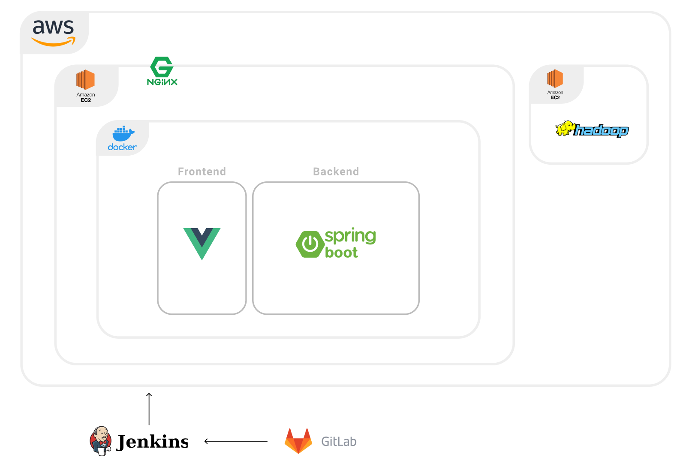
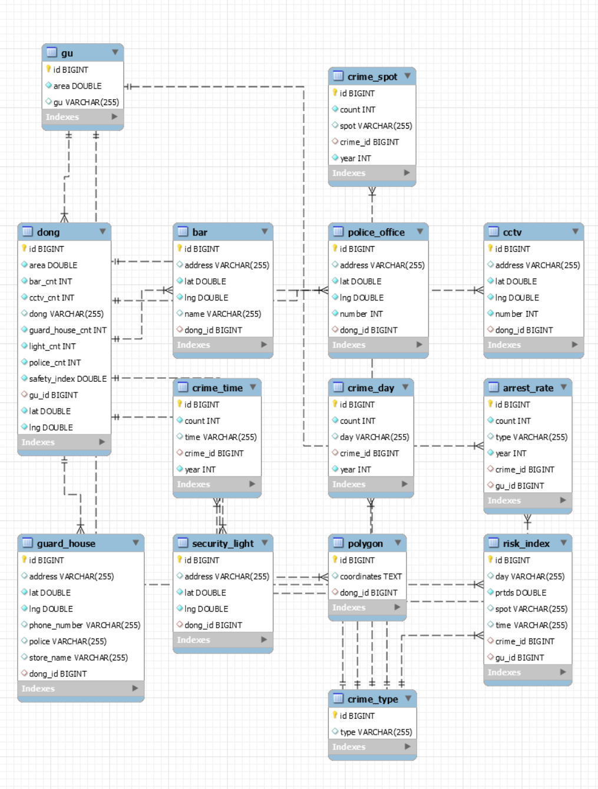

build test11

## 🎥 프로젝트 개요

### 진행 기간

- 2021.08.23 ~ 2021.10.07

### 주제

- 지역별(서울시) 범죄 분석과 공간 특성에 기반한 범죄 취약지 예측/안전지대 제안

### 목표

1. 서울시 범죄 분석과 공간 특성에 기반한 범죄 안전지대 제안
2. 서울시 지역별 범죄 발생 요인 분석 후 안전지대 제안

### 프로젝트 RULE

1. JPA를 사용해서 DB와 백엔드를 연동한다.
2. Jira를 사용하여 1주일 단위의 스프린트를 진행하고 프로젝트를 관리한다.
3. 매일 오전, 오후 스크럼 미팅을 실시하고 Mattermost에 기록한다.
4. 서비스 배포 환경으로는 아마존 EC2와 Docker 컨테이너를 사용한다.
5. 정한 git commit 규칙을 준수하여 프로젝트 형상 관리를 한다.

### 와이어프레임


<br>

## 🍀 핵심기능

- 지역별 범죄 분석 시각화 - 구 단위로 범죄 발생 건수 자료 이용
- 공간 특성(CCTV, 유흥지, 유동인구 등)을 고려해서 범죄 취약지 예측
- 지도로 안전지수 및 평가 지표 제공

## 📚 Tech Stack

<details>
    <summary>Front</summary>
    <ul>
        <li>Vue3</li>
        <li>Vue CLI</li>
        <li>Vuex</li>
        <li>BootStrap</li>
        <li>Element Plus</li>
    </ul>
</details>
<details>
    <summary>Back</summary>
    <ul>
        <li>SpringBoot</li>
        <li>MySQL</li>
        <li>Swagger</li>
        <li>JPA</li>
        <li>docker</li>
        <li>Jenkins</li>
    </ul>
</details>
<br>

## 📊 서비스 구조도



## 💿 DB 모델링



## 💻 개발환경

- JDK 1.8
- nginx 1.21.3
- Spring boot 2.5.5
- gradle 7.2
- MySQL 8.0.26
- Intellij IDEA Ultimate 2020.3.1
- Vue 2
- VsCode 1.60.2
- Jenkins 2.303.1
- Docker 20.10.8

## 💻 빌드 및 배포

### Frontend

```bash=
cd frontend
npm install
run build
docker build -t nginx:0.1 -f FrontDockerfile .
docker run -d --name nginx -p 80:80 -p 443:443 nginx:0.1
```

### Backend

```bash=
cd backend
docker build -t back:0.1 -f BackDockerfile .
docker run -d --name back -p 8443:8443 back:0.1
```
