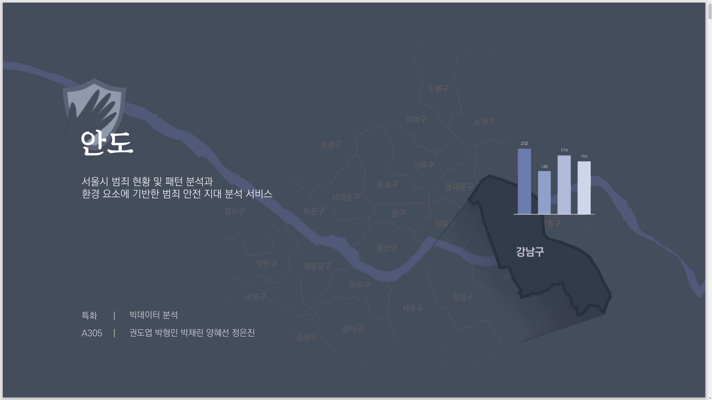

# 안도

---

#### 주제 : 서울시 범죄 분석과 공간 특성에 기반한 범죄 안전지대 제안

##### 개요 : 셉테드를 기반으로 서울시의 범죄 현황과 공간 특성을 분석하여 우리만의 안전지수를 제공한다.

- 서울시 범죄 분석 시각화 - 구 단위로 범죄 발생 건수 자료 이용
- 공간 특성(CCTV, 유흥지, 파출소 등)을 고려해서 범죄 취약지 예측
- 지도로 안전지수 및 평가 지표 제공
